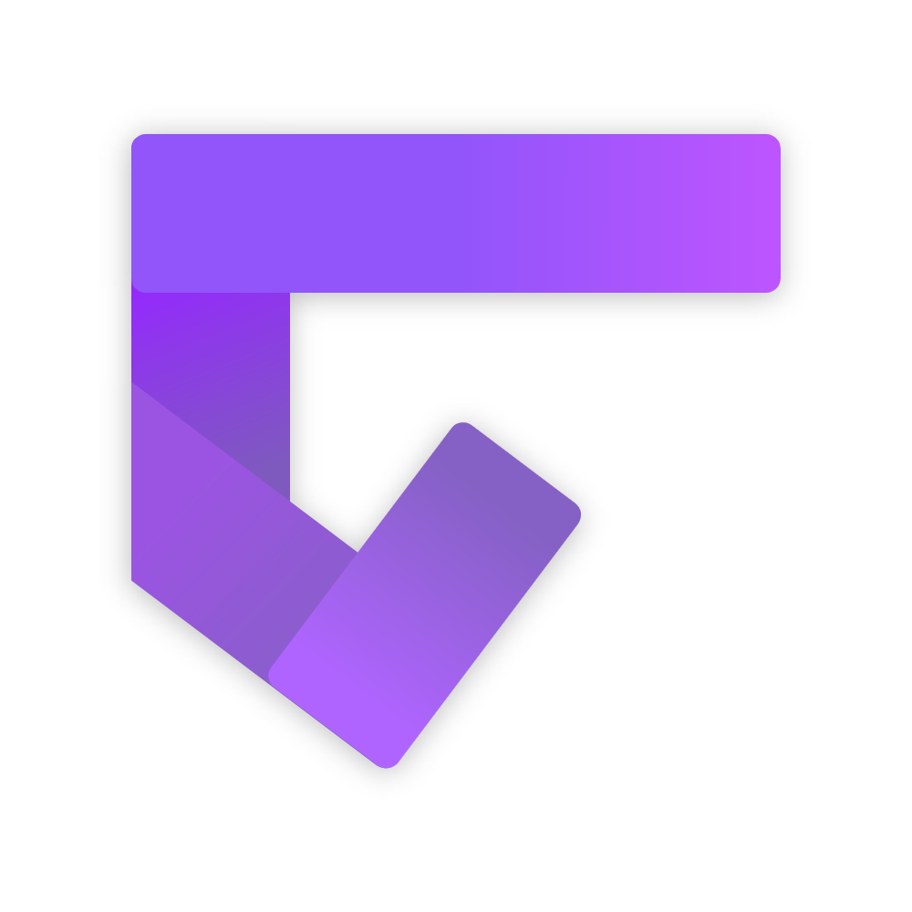

 

  

  <h1 align="center">Gavilya</h3>

  

    A simple game launcher written in C# .NET 6.
     
    <a href="https://bit.ly/Gavilya"><strong>Download »</strong></a>
     
    <a href="https://github.com/Leo-Corporation/Gavilya/issues/new?assignees=&labels=bug&template=bug-report.yml&title=%5BBug%5D+">Report Bug</a>
    ·
    <a href="https://github.com/Leo-Corporation/Gavilya/issues/new?assignees=&labels=enhancement&template=feature-request.yml&title=%5BEnhancement%5D+">Request Feature</a>
    ·
    <a href="https://github.com/Leo-Corporation/Gavilya/issues?q=is%3Aopen+is%3Aissue+label%3Abug">Known Issues</a>

  

## Introduction

Gavilya is a user-friendly game launcher built using C# and WPF, following the MVVM (Model-View-ViewModel) architectural pattern. The launcher aims to simplify the process of managing and launching games from various sources, providing an organized and personalized gaming experience.
[Click here](https://gavilya.leocorporation.dev) to visit Gavilya's website.

## Features

Gavilya is a user-friendly game launcher built using C# .NET 6 and WPF, designed to streamline the gaming experience by consolidating games from various sources into a single, accessible platform. With its intuitive interface and diverse set of features, Gavilya offers gamers a convenient and organized way to manage and launch their favorite games.

1. **Game Source Integration:**
   Gavilya supports a wide range of game sources, including Steam, UWP (Universal Windows Platform), and Win32 games. This compatibility ensures that users can effortlessly add and manage their games, regardless of their origin.

2. **RAWG.io Integration:**
   Gavilya incorporates the power of the RAWG.io database, allowing users to fetch essential game information, such as cover art, release dates, and descriptions, directly within the launcher. This integration enhances the user experience by providing valuable context for each game.

3. **Profiles:**
   With Gavilya's profile feature, users can create multiple profiles, each tailored to a specific set of games or preferences. This enables effortless switching between different gaming setups or genres without the need for manual reorganization.

4. **Themes:**
   Gavilya lets users personalize their launcher with a variety of themes, enabling them to choose a visual style that resonates with their gaming aesthetic. Themes offer a fresh look to the launcher and enhance the overall gaming atmosphere.

5. **Game Tags:**
   Organizing games is made easier with the inclusion of game tags. Users can assign custom tags to their games, such as genres or play styles, facilitating quick and intuitive navigation through their game library.

6. **Multiple Views:**
   Gavilya offers different viewing options for users to explore their game collection. These include "Recent" for recently played games, "List" for a comprehensive overview, and "Tags" for grouping games based on assigned tags. This flexibility allows users to choose the view that best suits their needs.

7. **Search Functionality:**
   Searching for specific games within a large library is effortless with Gavilya's built-in search feature. Users can quickly locate games by entering keywords or partial names, saving time and ensuring they get to gaming faster.

8. **Statistic Overview:**
   Gavilya provides users with valuable insights into their gaming habits. This includes statistics such as total playtime for each game, as well as identifying the most frequently played games. This overview helps users keep track of their gaming history and preferences.

9. **Top Games Highlight:**
   Gavilya's statistic overview highlights the top games based on playtime or user-defined criteria. This feature enables users to discover their favorite and most-played games easily.
   
**_And more..._**

In conclusion, Gavilya presents itself as a user-centric game launcher, combining simplicity with a powerful set of features. By seamlessly integrating games from various sources, offering profile support, providing customization options, and supplying insightful statistics, Gavilya elevates the gaming experience for enthusiasts who appreciate organization and efficiency. [Click here](https://gavilya.leocorporation.dev) to visit Gavilya's website and explore its features firsthand.

## Download
[Click here](https://bit.ly/Gavilya) to download Gavilya.

## Contributing
Contributions are welcome! If you find any issues or have suggestions for improvements, please open an issue or submit a pull request.

1. **Fork the Repository**: Start by forking the Gavilya repository to your GitHub account.

2. **Clone the Fork**: Clone your forked repository to your local machine using `git clone https://github.com/your-username/Gavilya.git`.

3. **Create a Branch**: Create a new branch for your contribution using a descriptive name. For example, `feature/new-theme` or `bugfix/issue-123`.

4. **Make Changes**: Make your desired changes or additions to the codebase.

5. **Test**: Run tests (if available) to ensure your changes do not introduce new issues.

6. **Commit and Push**: Commit your changes and push them to your forked repository.

7. **Create a Pull Request (PR)**: Go to the original Gavilya repository and create a new pull request. Provide a clear title, description, and link to any related issues.

8. **Code Review**: The maintainers will review your PR, provide feedback, and possibly suggest changes.

9. **Iterate and Merge**: Make any necessary changes based on the feedback received. Once the PR is approved, it will be merged into the main repository.

Please note that contributions should align with the project's scope and follow the existing code style and guidelines. By contributing, you agree that your work will be licensed under the project's [MIT License](LICENSE).

### Tools

- Visual Studio 2022 v17.0 or higher (VS2019 also works)
  - .NET Desktop Developpement
  - Git
- .NET 6 (*.NET 5 is also recommanded*)
- Inno Setup (*optionnal*)

### Branches
This Git repo has always two branches:

| Name | Release | Description |
| :--: | :-----: | :---------: |
| `main` |  | Stable versions |
| `vNext` |  | Next version of Gavilya (unstable) |

> Note: Other branches can also - of course - exist.

## License

This project is licensed under the [MIT License](LICENSE).

---

Visit the [Gavilya website](https://gavilya.leocorporation.dev) to learn more about the game launcher.
